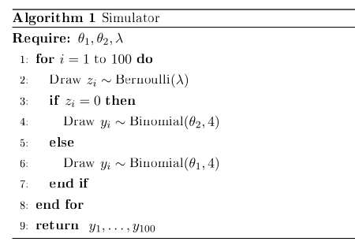

# Approximate Bayesian Computation - Final Project

# Mixture of Distributions

Let $x = (x_1, \cdots, x_{100})$ be an i.i.d from the following mixture model:

$$
\lambda \cdot Bin(x_i | \theta_1, N = 4) + (1 - \lambda) \cdot Bin(x_i| \theta_2, N=4)
$$

The parameters of interest are $\lambda$, $\theta_1$ and $\theta_2$. We want to get samples from 
the posterior distribution

$$
p(\lambda, \theta_1, \theta_2 | x_1, \cdots, x_{100})
$$

by assuming the following prior distributions:

- $\lambda \sim U(0,1)$
- $(\theta_1, \theta_2)$ uniformly distributed over the set $\{(\theta_1, \theta_2): 0 \le \theta_2 \le \theta_1 \le 0\}$

## Simulator

The data stochastic generative model can be reproduced as follows:

> **Proposal distributions should be consistent with the imposed constraints.**